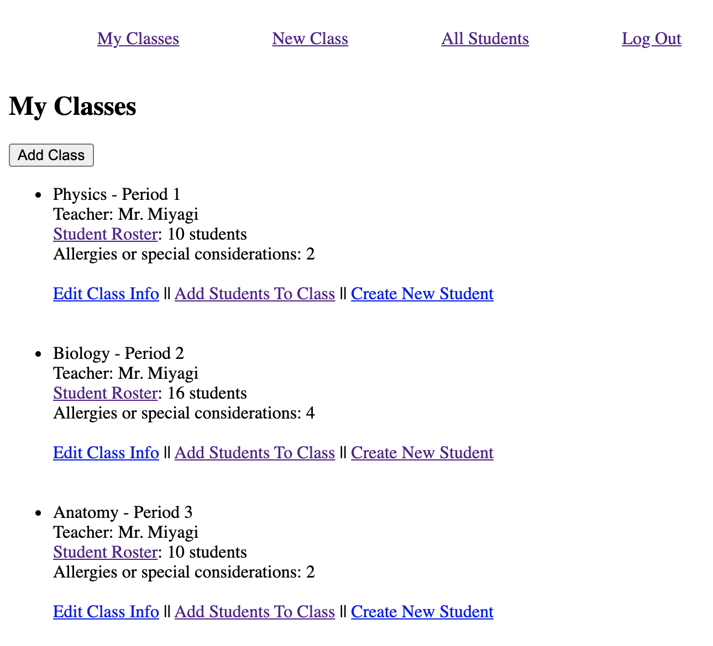
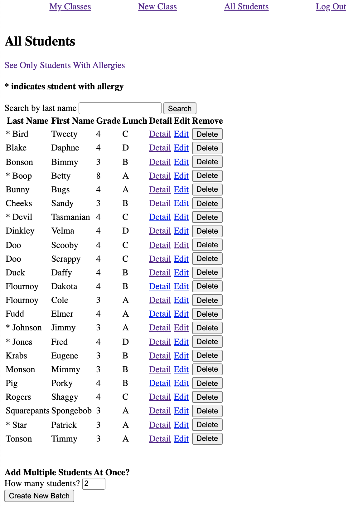

# README

Welcome! This is a student allergy tracker for schools. The idea is that teachers or administrators would sign up, log their student rosters and record the allergies and dietary restrictions of their students. That way, a teacher looking at their class list before a field trip would know quickly whether they needed to bring an epi pen with them, and a cafeteria worker could look to see what students have food allergies that they need to take into account during each lunch period. Enjoy!

## Installation

1. Visit the Google Developers Console at https://console.developers.google.com and       register the app to recieve a Client ID and Secret. These will allow you to have users sign up and log in through Google.  
2. Clone or copy this repo
3. While in the project directory, type `bundle install` in your terminal 
4. Create a `.env` file in the project directory
    3a. The file actually needs to be *called* `.env` (nothing before the extension) 
    3b. BEFORE YOU SAVE OR COMMIT ANYTHING - Make sure that `.env` is in your `.gitignore`  
    3c. Inside this file, define variables called GOOGLE_CLIENT_ID and GOOGLE_CLIENT_SECRET with the information you got from the Google Developer site
        ex. GOOGLE_CLIENT_ID= 123456789abcd...
            GOOGLE_CLIENT_SECRET= 987654321abcd...
    3d. This variable is called in `config/initializers/omniauth.rb`

## Usage

1. To start up your server type `rails s` in your terminal inside the project directory
2. From there, just sign up and play around! For a video showing the intended uses and 
how some things work within the app: https://youtu.be/K1__u0EIOSo 

## Contributing

Bug reports and pull requests are welcome on GitHub at https://github.com/cole-flournoy/rails-student-allergies.

## License

The gem is available as open source under the terms of the [MIT License](https://opensource.org/licenses/MIT).

